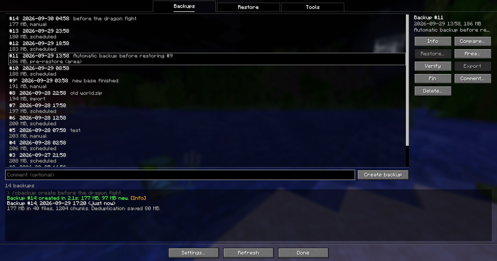
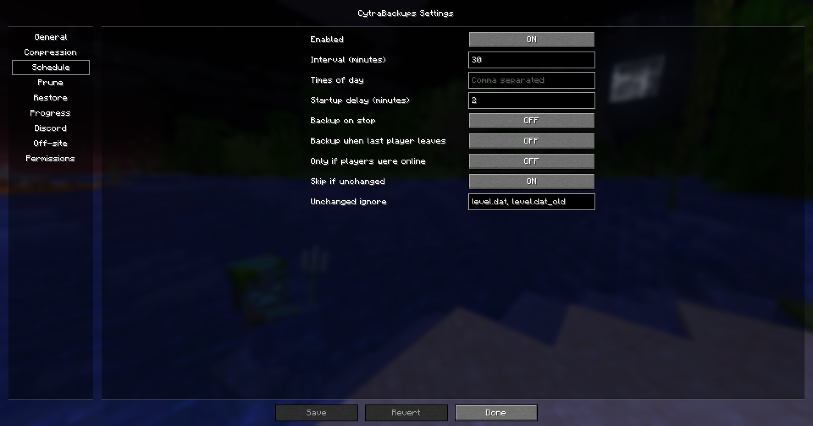
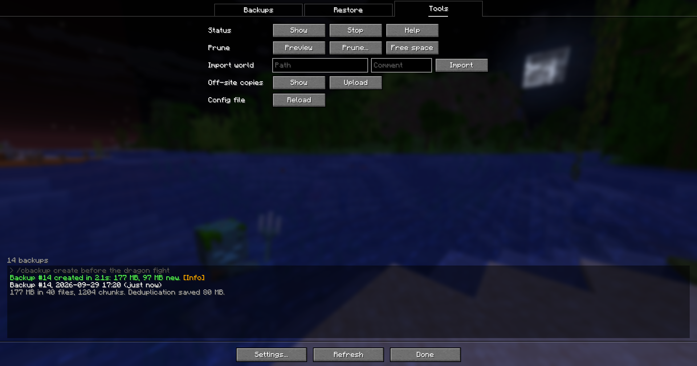
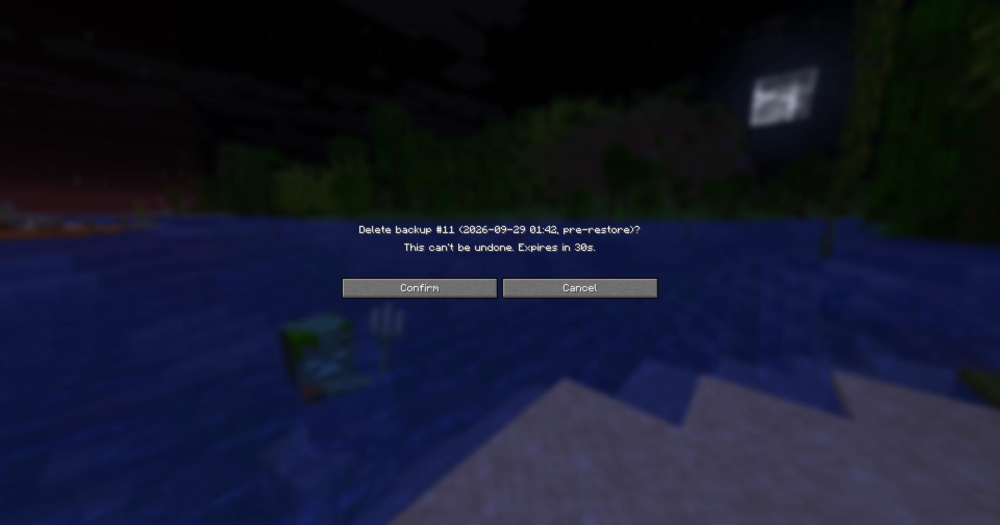

# CytraBackups

**World backups for Fabric servers and singleplayer, Minecraft Java 1.21.11.**
Only changed chunks are stored again, restores are safe and can be undone, and everything works from chat commands or an in-game menu.

**[Download the latest release](https://github.com/steelaspect/cytrabackups/releases/latest)** | [What's new](CHANGELOG.md)

| Backups | Settings |
|---|---|
|  |  |
| **Tools** | **Confirmation** |
|  |  |

## Install

1. Install [Fabric Loader](https://fabricmc.net/use/) and [Fabric API](https://modrinth.com/mod/fabric-api) for Minecraft 1.21.11.
2. Download `cytrabackups-<version>.jar` from [Releases](https://github.com/steelaspect/cytrabackups/releases/latest) and put it in the `mods/` folder of your server (or your singleplayer game).
3. Start the game or server. Backups are stored in `backups/cytrabackups/` and the settings in `config/cytrabackups.json`.

Players don't need the mod to use it: every feature works through `/cbackup` commands with clickable chat. Installing it on the client as well adds the in-game menu. It runs entirely inside Minecraft, so it works on panel hosts (Pterodactyl and similar) without shell access.

## Features

- **Small backups.** Files and individual chunks are stored once; a backup only adds what changed since the last one. Compressed with zstd.
- **Automatic backups** on an interval, at fixed times of day, when the server stops, or when the last player leaves. Skipped when nothing changed.
- **Automatic cleanup** keeps the last N backups plus hourly, daily, weekly and monthly ones. Optional age and size limits. Pinned backups are never removed.
- **Safe full restores:** you confirm, a countdown warns everyone, a backup of the current world is taken first, and the restore is checked before the world loads. Every restore can be undone with `/cbackup rollback`.
- **Restore just an area** (chunks, a region or a radius around you), including entities. Done live when nobody is near it, otherwise at the next restart.
- **Compare, verify, export and import:** see what changed between backups, check a backup is intact, download any backup as a world `.zip`, or import an old world.
- **Off-site copies** to S3-compatible storage (AWS, Cloudflare R2, Backblaze B2, MinIO and others), SFTP or WebDAV.
- **Discord notifications** for finished and failed backups, restores and low disk space.
- **Progress** in a boss bar or the action bar.
- **Permissions** with LuckPerms or any mod using fabric-permissions-api, or plain op levels.

## In-game menu

With the mod on your client, open it with `/cbackupgui`, the **Backups** button in the pause menu, or a key you set in Controls > CytraBackups.

- **Backups:** select a backup to see its details, then Info, Compare, Restore (whole world), Area (pick chunks on a map), Verify, Export, Pin, Comment or Delete. Create new backups with an optional comment.
- **Restore:** show, cancel or apply a queued restore, undo the last restore, or cancel a countdown.
- **Tools:** status, cleanup preview and cleanup, free space, import a world, off-site status and sync.
- **Settings:** every option, with an explanation on hover. Changes are saved and applied immediately. Passwords and keys are never shown.

Buttons you don't have permission for are greyed out, and anything destructive asks you to confirm first.

## Commands

All commands start with `/cbackup`, or the short alias `/cb` (`/cbackup help` lists them). The mod doesn't register `/backup`, so it can't clash with other backup mods.

| Command | What it does |
|---|---|
| `create [comment]` | Back up now |
| `list [page]` | List backups, newest first |
| `info <id>` | Details of one backup |
| `diff <id1> <id2>` | What changed between two backups |
| `comment <id> [text]` | Set or clear a comment |
| `pin <id>`, `unpin <id>` | Pinned backups are never cleaned up |
| `delete <id>` | Delete a backup |
| `restore <id>` | Restore the whole world |
| `restore <id> radius <r>` | Restore chunks around you |
| `restore <id> chunks <dim> <x1> <z1> <x2> <z2>` | Restore a rectangle of chunks (chunk coordinates are block coordinates divided by 16) |
| `restore <id> region <dim> <rx> <rz>` | Restore one region file (32x32 chunks) |
| `rollback` | Undo the last restore |
| `pending [cancel\|apply]` | Show, drop or apply now a restore waiting for the next restart |
| `verify <id>` | Check a backup is intact |
| `export <id>` | Make a world `.zip` of a backup |
| `import <path> [comment]` | Import a world folder or `.zip` |
| `prune [dryrun]` | Clean up old backups (`dryrun` only shows what would go) |
| `gc` | Free space no backup uses any more |
| `status` | Running job, next backup, disk space |
| `cancel` | Stop the running job or countdown |
| `reload` | Reload the config file after editing it by hand |
| `offsite [status\|sync]` | Off-site copies |

## Permissions

Nodes are `cytrabackups.<name>`. Without a permissions mod, these op levels apply (changeable in Settings > Permissions):

| Permission | Default op level |
|---|---|
| `list`, `create`, `comment`, `verify`, `progress` (see the boss bar) | 2 |
| `pin`, `cancel`, `prune`, `export`, `delete` | 3 |
| `restore`, `admin` (settings, reload, import, off-site) | 4 |

In singleplayer, turn on cheats (or "Allow Commands" when opening to LAN).

## Good to know

- **Full restores** stop the server (singleplayer: close the world) and are applied when it starts again, before the world loads. On hosts that don't restart automatically, set Settings > Restore > Apply mode to `shutdown`.
- **Area restores** happen live only when no player is close enough to keep those chunks loaded (about view distance + 13 chunks, e.g. 416 blocks at render distance 12). Otherwise they are applied at the next restart, and the message says why.
- **Settings** can be changed in the menu, or in `config/cytrabackups.json` followed by `/cbackup reload`. Every option has a comment explaining it.

## Credits and license

Made by SteelAspect. MIT licensed ([LICENSE](LICENSE)). Inspired by [x-backup](https://github.com/zly2006/x-backup) (no code copied). Bundles aircompressor, fabric-permissions-api and JSch.
